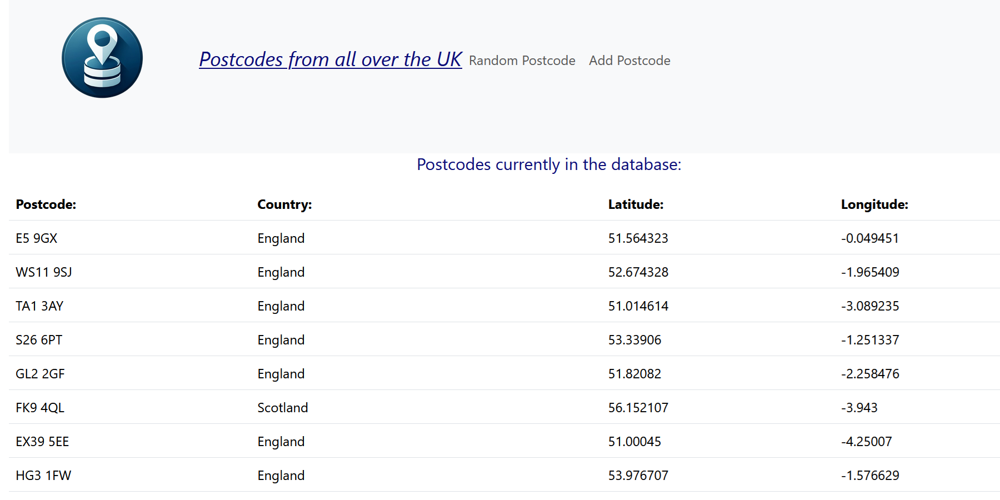

# React + TypeScript + Vite Postcode App

<!--  -->

## Made to learn about React.

-   There is another repo for the backend which is .NET and C#. This is not
    deployed so the postcodes do not currently load on the main page.

## React app deployed to github pages using this guide:

-   https://create-react-app.dev/docs/deployment/

-   Needed to change the script to: `"deploy": "gh-pages -d dist",`
-   Needed to add `base: "https://feargh.github.io/postcode-react/",` to
    vite.config.ts
